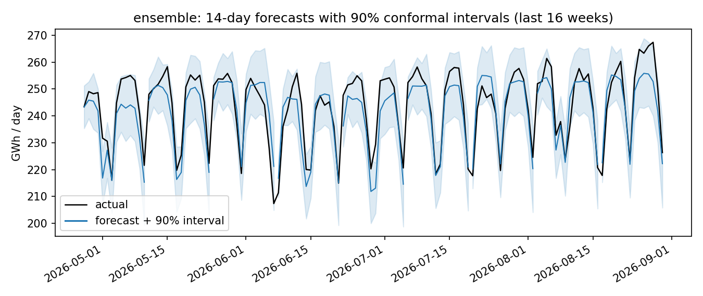
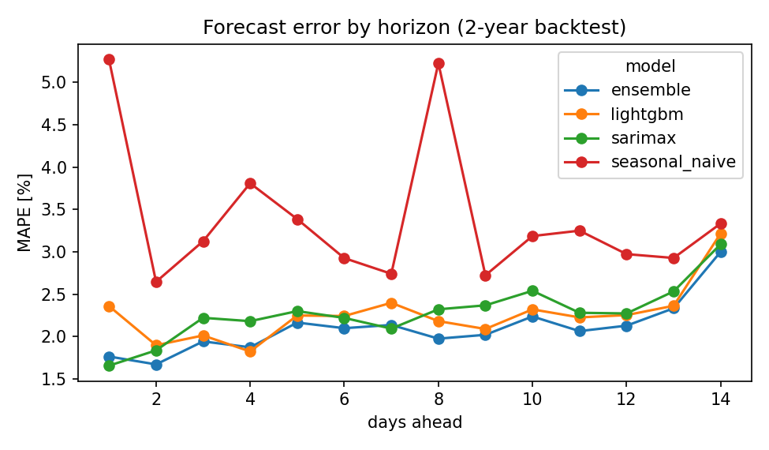

# Colombian Electricity Demand Forecasting

14-day-ahead forecasts of **daily national electricity demand in Colombia**, built on real hourly data from
[XM](https://www.xm.com.co/) (the national grid operator) for Jan 2019 - Aug 2026.

The focus is on a fair evaluation rather than a single good-looking chart: a **2-year rolling-origin
backtest** (52 forecast origins, each model re-fitted using only past data), a formal **Diebold-Mariano test**
to check whether accuracy differences are real, and **conformal prediction intervals** whose coverage is
checked on data they were not calibrated on. All runs are tracked in **MLflow**.

## Results (Sep 2024 - Aug 2026, 14-day horizon)

| Model | MAPE | MAE (GWh/day) | RMSE |
|---|---|---|---|
| Seasonal naive (same weekday last week) | 3.39% | 7.65 | 11.51 |
| SARIMAX + Colombian holiday regressors | 2.28% | 5.18 | 6.95 |
| LightGBM, direct multi-horizon, lag + calendar features | 2.26% | 5.17 | 6.57 |
| **Equal-weight ensemble (SARIMAX + LightGBM)** | **2.10%** | **4.79** | **6.19** |

Statistical checks (Diebold-Mariano on absolute errors, Newey-West variance):

| Comparison | p-value | Reading |
|---|---|---|
| LightGBM vs seasonal naive | 0.001 | real improvement (~33% lower MAPE) |
| LightGBM vs SARIMAX | 0.96 | **no evidence** one is better |
| Ensemble vs LightGBM | 0.02 | ensemble is significantly better |
| Ensemble vs SARIMAX | 0.07 | better, borderline significance |

90% conformal intervals (calibrated on the first year of folds, tested on the second): **94.8% empirical
coverage**, slightly conservative.





**Why the naive model spikes at days 1 and 8:** forecast origins fall on Sundays, so steps 1 and 8 are Mondays,
and Colombia moves most public holidays to Monday ("puentes"). Demand drops sharply on those days. Models with
holiday regressors handle it; copying last week does not.

**Decision:** two very different model families reach the same accuracy, and their errors are only partly
correlated, so averaging them is the most accurate and most robust option at no extra fitting cost.

## Method

- **Data**: `DemaReal` (real demand) hourly values from the public XM API, summed to GWh/day; 2,800 days, no gaps.
- **Features**: day of week, annual seasonality (Fourier), Colombian holidays + the day before / after,
  Christmas-season flag, trend, and lags that respect the horizon (lag >= h) so no future data leaks in.
- **SARIMAX**: SARIMA(1,0,1)x(1,1,1)_7 on log demand, last 3 years, holiday / calendar exogenous variables.
- **LightGBM**: direct strategy, one model for days 1-7 and one for days 8-14, trained on log demand.
- **Backtest**: origins every 14 days from 2024-09-01; each origin re-fits every model with data up to that day.

## Run it

```bash
pip install -r requirements.txt
python scripts/run_backtest.py      # uses data/daily_demand.csv; delete it to re-download from XM
mlflow ui --backend-store-uri sqlite:///mlflow.db
pytest -q
```

## Structure

```
src/demand_forecast/
  data.py       XM API client -> daily series
  features.py   calendar, holiday and leakage-safe lag features
  models.py     SeasonalNaive, SarimaxHolidays, LightGBMDirect (common forecast() interface)
  backtest.py   rolling origin, metrics, Diebold-Mariano, split-conformal intervals
scripts/run_backtest.py
tests/          leakage, holiday, metric and coverage tests
```

## Author

Manuel Alejandro Polo González · [Portfolio](https://manuelpg21.github.io/data-ml-portfolio/) · [LinkedIn](https://www.linkedin.com/in/manuel-alejandro-p-339754118)
